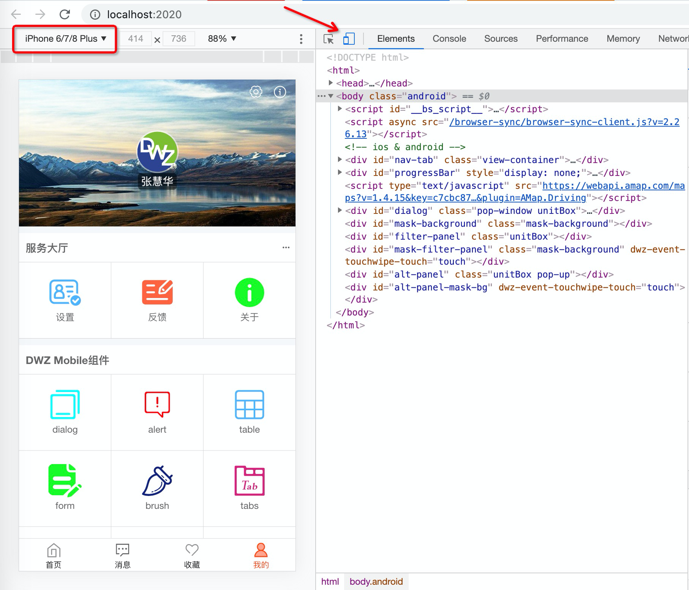
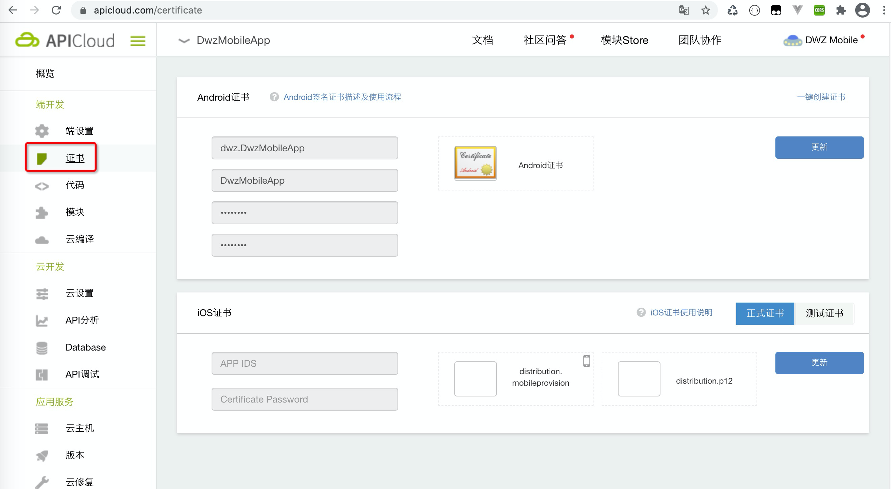
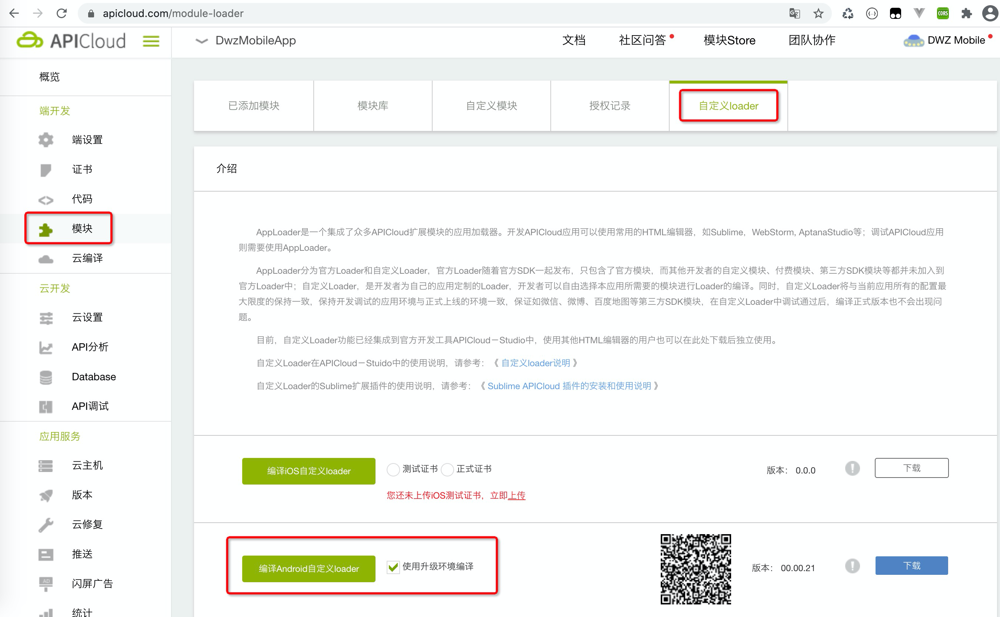
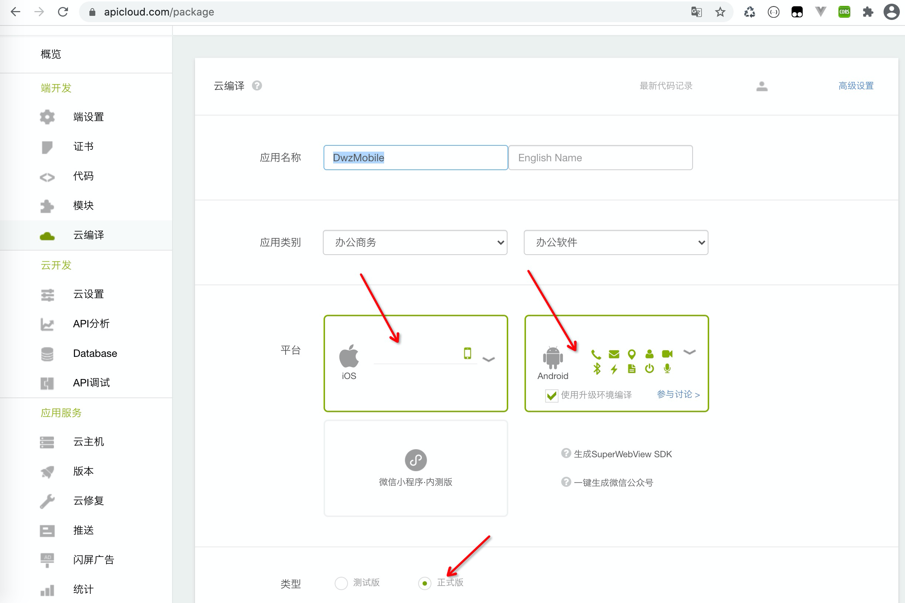

## DWZ Mobile 介绍

DWZ 移动端HTML5混合APP开发框架

**设计思路**

1. 灵活定制扩展方便：gulp构建工程，组件html结构、css（使用less）、javascript完全开放，可以实际项目要求灵活定制。
2. 轻量级：封装精简版核心库dwz.core.js，相当于一个专门针对移动端优化的精简版jQuery，代码量只有jQuery 的十分之一左右，使用方式基本同jQuery。
3. 统一风格：UI组件不依赖于第三方组件库，都是统一封装的，组件样式可以灵活定制。
4. 跨平台：Android应用、iOS应用、公众号。
5. 支持屏幕自适配：手机、平板、PC、大屏（包含非正常比例拼接屏）界面布局可以支持自动适配。

**Require:**

- node\^10.13.0 `https://nodejs.org/en/download`
- npm\^6.14.5 `新版的nodejs已经集成了npm`

> ### Quickstart

1. 下载 DWZ Mobile 开源项目源码
```
git clone https://gitee.com/dwzteam/dwz_mobile_app.git
```
2. 开发环境 Chrome 中运行

    - 第一次运行，需要初始化工程 `npm intall`
    - 前端开发模式运行，会自动打开chrome `npm run dev`
    

3. Android、iOS 手机真机调试

    - 在APICloud控制台配制证书
    
    
    - APICloud【自定义loader】打包（注意：iOS打包需要配制测试证书）
    
    
    - 打包完成后，手机扫码下载安装App
   
    - 项目根目录下，命令行执行 `npm run start`，控制台返回成功信息
    
    
    - 打开运行自定义loader打包的App，点击旁边的圆形按钮，根据上一步返回的信息输入IP和端口号
    
    
    
    - 真机代码同步 `npm run sync`
    
    - 控制台查看真机运行日志 `npm run log`
    
4. 打包发布

    - 代码压缩混淆打包 `npm run build`
    - index.html 页面中 `loadScripts({env: 'dev'})` 改成 `loadScripts({env: 'build'})` 
    - 提交代码
    - 云编译
    
    

> ### Demo 演示
- 在线演示版，使用chrome 开发模式设置手机版 `http://mobile.jui.org`
- 安卓Apk安装设置版 `http://mobile.jui.org/apk/dwz_mobile_dev.apk`
- 视频演示 `http://mobile.jui.org/video/dwz_mobile.mp4`

<video width="320" controls preload="none" poster="http://mobile.jui.org/video/dwz_mobile.png">
    <source src="http://mobile.jui.org/video/dwz_mobile.mp4">
</video>

> ### 联系

- 网站：http://jui.org
- DWZ官方微博：http://weibo.com/dwzui
- 邮箱：z@j-ui.com

|技术服务微信|
|:---:|
||

> ### 捐助

如果您觉得我们的开源软件对你有所帮助，请扫下方二维码打赏我们一杯咖啡。

|支付宝|微信|
|:---:|:---:|
|||


