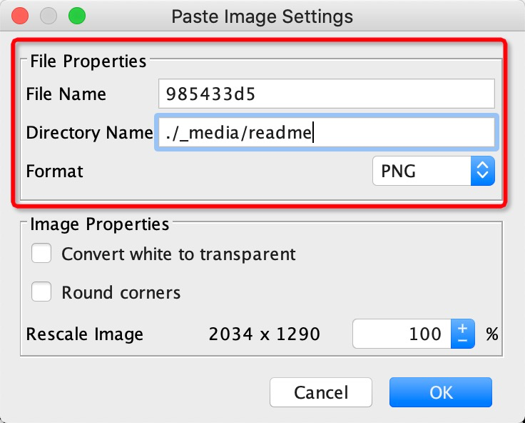

## dwz_mobile_doc_v1

> ### 介绍

DWZ 移动端开发框架文档

> ### 捐助

如果您觉得我们的开源软件对你有所帮助，请扫下方二维码打赏我们一杯咖啡。

|支付宝|微信|
|:---:|:---:|
|||

> ### 联系

- 网站：http://jui.org
- DWZ官方微博：http://weibo.com/dwzui
- 邮箱：z@j-ui.com

> ### 快速使用

- 安装[docsify](https://docsify.js.org)
```bash
npm i docsify-cli -g
```
- 启动项目

进入项目根目录下，执行以下命令

```bash
npm run serve
```

当提示`Listening at http://localhost:3000`时，表示服务启动成功。

> ### 新增文档

`__sidebar.md`为导航栏，使用方法参考：[loadsidebar](https://docsify.js.org/#/zh-cn/configuration?id=loadsidebar)

- 让IDE的markdown编辑器支持上传图片

进入`File - Settings - Plugins`， 搜索`markdown`关键字， 安装 `Paste Image into Markdown` 插件


安装完成后重启IDE， 再次编辑`markdown`文件时，截图后直接在md文件中粘贴,会弹出如下弹窗：



理论上只需要修改目录即可， 文件名都是随机值，最终文件上传生成8位随机多件名+后缀png

> ### 部署文档

- 原生部署（类似启动，然后使用Nginx代理即可）
- Gitee Pages


上图两个地方使用默认配置即可

最后点击“更新”，等待大概1分钟，当出现`已开启 Gitee Pages 服务，网站地址： http://innodev_group.gitee.io/innodev-doc`则标识部署完成


> ### 关于docsify

本文档使用[docsify](https://docsify.js.org)搭建，详情请查阅官方文档。


> ### Gitee特技

1.  使用 Readme\_XXX.md 来支持不同的语言，例如 Readme\_en.md, Readme\_zh.md
2.  Gitee 官方博客 [blog.gitee.com](https://blog.gitee.com)
3.  你可以 [https://gitee.com/explore](https://gitee.com/explore) 这个地址来了解 Gitee 上的优秀开源项目
4.  [GVP](https://gitee.com/gvp) 全称是 Gitee 最有价值开源项目，是综合评定出的优秀开源项目
5.  Gitee 官方提供的使用手册 [https://gitee.com/help](https://gitee.com/help)
6.  Gitee 封面人物是一档用来展示 Gitee 会员风采的栏目 [https://gitee.com/gitee-stars/](https://gitee.com/gitee-stars/)


