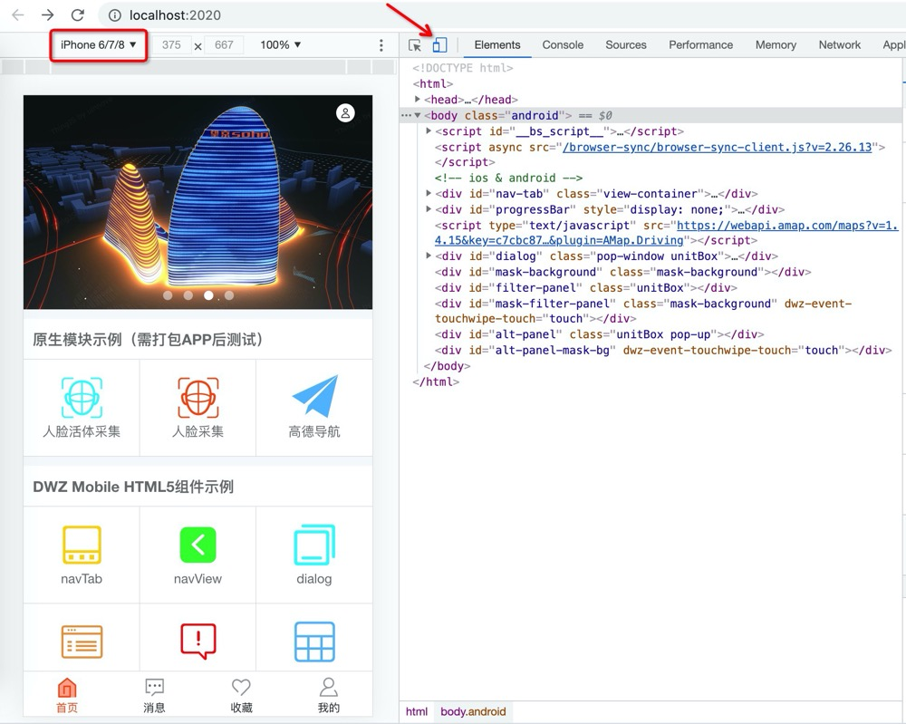

> ## 概述

- DWZ 手机版 HTML5 + 原生 混合开发框架。
- 基于原生 JS 轻量级移动端开发框架，核心代码库 dwz.core.js 使用方式和 jQuery 80%相似，针对移动端精简优化代码（核心库代码相当于 jQuery 的十分之一）。
- [DWZ Mobile 详细文档](http://dwzteam.gitee.io/dwz_mobile_doc_v1)

> ## Demo 演示

- 在线演示版，使用 chrome 开发模式设置手机版 `http://mobile.jui.org`
- 安卓 Apk 安装测试版 `http://mobile.jui.org/apk/dwz_mobile_app.apk`
- 视频演示 `http://mobile.jui.org/video/dwz_mobile.mp4`

<video width="320" controls preload="none" poster="http://mobile.jui.org/video/dwz_mobile.png">
    <source src="http://mobile.jui.org/video/dwz_mobile.mp4">
</video>

> ## 设计思路

1. 灵活定制扩展方便：gulp 构建工程，组件 html 结构、css（使用 less）、javascript 完全开放，可以实际项目要求灵活定制。
2. 轻量级：封装精简版核心库 dwz.core.js，相当于一个专门针对移动端优化的精简版 jQuery，代码量只有 jQuery 的十分之一左右，使用方式基本同 jQuery。
3. 统一风格：UI 组件不依赖于第三方组件库，都是统一封装的，组件样式可以灵活定制。
4. 跨平台：Android 应用、iOS 应用、公众号。
5. 支持屏幕自适配：手机、平板、PC、大屏（包含非正常比例拼接屏）界面布局可以支持自动适配。

**Require:**

- node\^10.13.0 `https://nodejs.org/en/download`
- npm\^6.14.5 `新版的nodejs已经集成了npm`

> ## Quickstart

### 1. 下载 DWZ Mobile 开源项目源码

```
git clone https://gitee.com/dwzteam/dwz_mobile_app.git
```

### 2. 开发环境 Chrome 中运行

- 第一次运行，需要初始化工程 `npm intall`
- 前端开发模式运行，会自动打开 chrome `npm run dev`
  

### 3. Android、iOS 手机真机调试

- [Android & iOS 真机调试文档](/doc/apicloud/package?id=真机调试)

### 4. 打包发布

- [Android & iOS 云打包文档](/doc/apicloud/package?id=云编译)
- [Android & iOS 发布和版本更新提示文档](/doc/apicloud/package?id=发布和版本更新)

> ## 联系

- 网站：http://jui.org
- DWZ 官方微博：http://weibo.com/dwzui
- 邮箱：z@j-ui.com

|               技术服务微信                |
| :---------------------------------------: |
|  |

> ## 捐助

如果您觉得我们的开源软件对你有所帮助，请扫下方二维码打赏我们一杯咖啡。

|                 支付宝                 |                 微信                  |
| :------------------------------------: | :-----------------------------------: |
|  |  |
