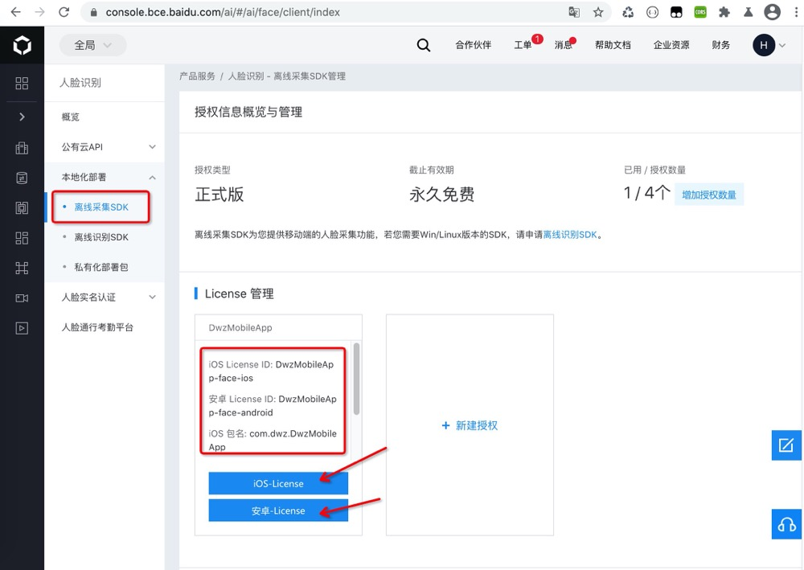

> ## 功能介绍

- HTML5 跨平台支持（Android & iOS）
- 人脸识别后可以精准截取头像
- 基于百度人脸采集 SDK，分 2 个版本：
  - 包含活体动作 `faceLiveness()`
  - 不包含活体动作 `faceDetect()`
  - [dwzBaiduFaceLive 模块前端调用示例 biz.faceBaidu.js](https://github.com/dwzteam/dwz_mobile_app/blob/master/widget/js/biz.baiduFace.js)

> ## 效果展示


> ## 模块使用攻略

1. 使用之前须从百度开放平台申请开发者账号并完成企业认证，获取 LicenseID 和 LicenseFileName。[百度开发平台控制台](https://console.bce.baidu.com/ai/#/ai/face/overview/index)
   
2. License 文件打包模块包需注意事项请参考 [模块配套授权包制作](/doc/apicloud/dwzBaiduFaceLive?id=模块配套授权包制作)，然后将制作好的授权模块包上传到自定义模块，添加到自己的 App 进行使用
3. APICloud 模块市场搜索 dwzBaiduFaceLive，增加到 APICloud 工程中
4. 使用此模块之前先配置 config.xml 文件，配置完毕后，需通过云端编译生效，配置方法如下：

```xml
<feature name="dwzBaiduFaceLive">
    <param name="LicenseID_iOS" value="DwzMobileApp-face-ios"/>
    <param name="LicenseFileName_iOS" value="idl-license.face-ios"/>
    <param name="LicenseID_Android" value="DwzMobileApp-face-android"/>
    <param name="LicenseFileName_Android" value="idl-license.face-android"/>
</feature>
```

5. [自定义 Loader 编译，真机调试](/doc/apicloud/package?id=真机调试)或者[云编译测试版](/doc/apicloud/package?id=云编译)
6. 代码调用

> 包含活体动作调用

```javascript
const module = api.require("dwzBaiduFaceLive");
module.faceLiveness(
  {
    debug: 0, // 调试开关(默认:0)：0, 1
    cropType: 1, // 抠图类型(默认:1)：1:脸部, 2:大头照, 3:头像+肩膀
    mouth: false, // 活体动作，张嘴(默认:false)
    headRight: false, // 活体动作，向右转头(默认:false)
    headLeft: false, // 活体动作，向左转头(默认:false)
    headUp: false, // 活体动作，向上抬头(默认:false)
    headDown: false, // 活体动作，向下低头(默认:false)
    headLeftOrRight: false, // 活体动作，摇头(默认:false)
  },
  function (ret, err) {
    alert(JSON.stringify(ret));
  }
);
```

> 不包含活体动作调用

```javascript
const module = api.require("dwzBaiduFaceLive");
module.faceDetect(
  {
    debug: 0, // 调试开关(默认:0)：0, 1
    cropType: 1, // 抠图类型(默认:1)：1:脸部, 2:大头照, 3:头像+肩膀
  },
  function (ret, err) {
    alert(JSON.stringify(ret));
  }
);
```

> ## 模块配套授权包制作

### 下载 dwzBaiduFaceLiveLicense.zip

制作 Android 和 iOS 授权包之前先下载 [dwzBaiduFaceLiveLicense.zip](http://mobile.jui.org/apk/dwzBaiduFaceLiveLicense.zip)

### Android 授权包

- 需要先确认自己的电脑安装了 jdk，配置 javahome 环境变量

1. 请将 `Android_命令处理包/assets` 目录下 `idl-license.face-android` 文件下替换为 Android 的 License 文件

2. 在 cmd 中切换到`Android_命令处理包`目录下，生成 jar 包

```bash
cd Android_命令处理包
jar -cvf dwzBaiduFaceLiveLicense.jar ./*
```

3. 在`Android_命令处理包`目录下会生成 `dwzBaiduFaceLiveLicense.jar` 文件

4. 将生成的 `dwzBaiduFaceLiveLicense.jar` 文件替换`zip/android/dwzBaiduFaceLiveLicense/source` 下的 `dwzBaiduFaceLiveLicense.jar` 文件

5. 将`zip/android/dwzBaiduFaceLiveLicense` 文件夹压缩为 `dwzBaiduFaceLiveLicense.zip`, 需要包含一层模块目录

### iOS 授权包

1. 将`zip/ios/dwzBaiduFaceLiveLicense/target` 下的 `idl-license.face-android` 替换为你自己的 `idl-license.face-ios` 文件
2. 将`zip/ios/dwzBaiduFaceLiveLicense` 文件夹压缩为 `dwzBaiduFaceLiveLicense.zip`

> ## 模块配套授权包上传

1. 登录 APICloud，进入一个 App 管理界面
2. 点击 App 管理界面中的 模块 -> 自定义模块 -> 上传自定义模块
   
