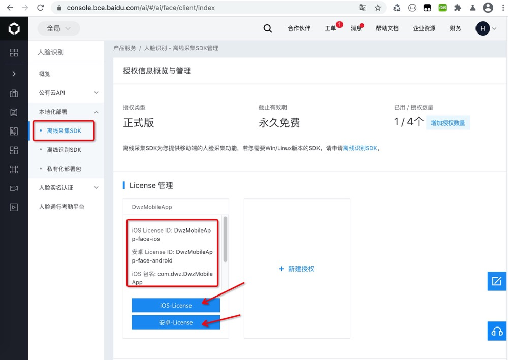
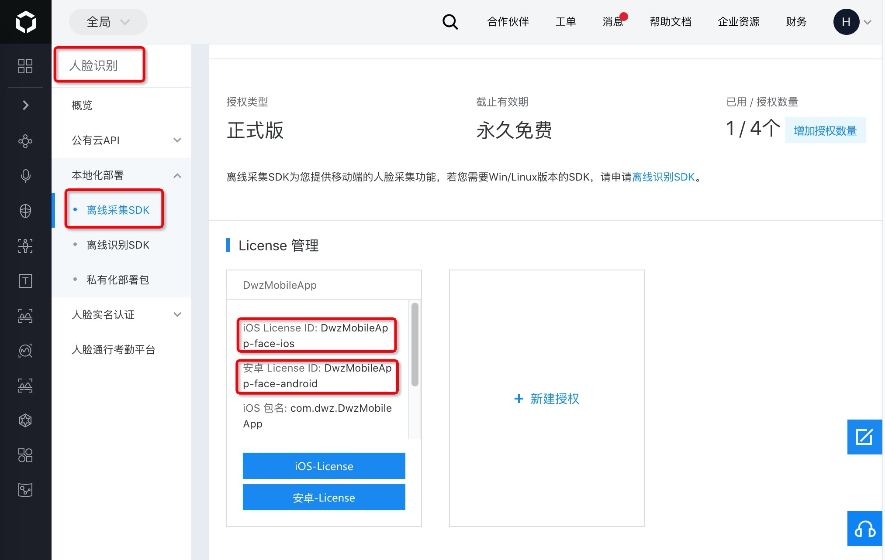
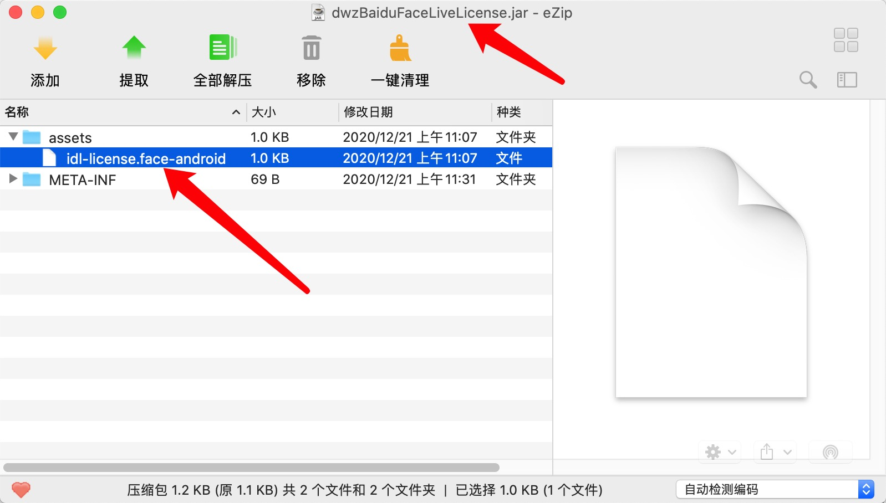
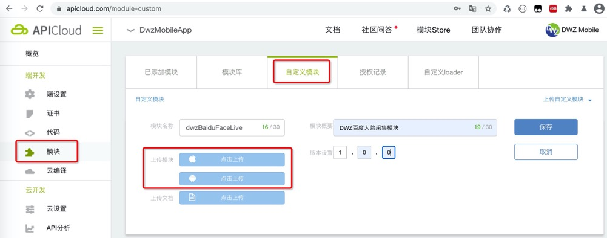

# dwzBaiduFaceLive 人脸识别【apicloud】

> ## 功能介绍

- 本模块封装了新版百度开放平台的人脸识别采集 SDK：
  - 包含活体动作 [faceLiveness](#a1)
  - 不包含活体动作 [faceDetect](#a2)
- 考虑灵活度问题，本模块只作人脸采集，人脸识别成功后生成 base64 头像图片，开发者可以配合服自己的务端接口实现具体的业务需求，如（实名认证、刷脸登录、人脸识别备案等）
- 人脸识别后自动截取头像，人脸抠图支持压缩比设定，从而解决了某些第三方实名认证接口图像大小不能超过 20K 的问题
- 人脸识别抠图分辨率可配制 高度 50~1200 像素，抠图高的设定，根据高度自动计算宽度（宽度=高度\*3/4）
- 人脸识别界面自带返回键，使用过程中随时可以退出人脸识别界面
- 可以免费从百度 AI 平台获取人脸采集证书，本模块针对一个 APP **一次购买永久使用**
- 跨平台支持（Android & iOS）
- [dwzBaiduFaceLive 模块前端调用示例 biz.faceBaidu.js](https://github.com/dwzteam/dwz_mobile_app/blob/master/widget/js/biz.baiduFace.js)
- [dwzBaiduFaceLive【dcloud】版本](/doc/dcloud/dwzBaiduFaceLive/doc.md)
- **模块使用含技术支持，远程协助调试模块请加微信沟通**

|                   技术服务微信                   |
| :----------------------------------------------: |
|  |

> ## 效果展示


> ## 使用攻略

1. 使用之前须从百度开放平台申请开发者账号并完成企业认证，获取 LicenseID 和 LicenseFileName。[百度开发平台控制台](https://console.bce.baidu.com/ai/#/ai/face/overview/index)
   
2. License 文件打包模块包需注意事项请参考 [模块配套授权包制作](/doc/apicloud/dwzBaiduFaceLive/doc?id=模块配套授权包制作)，然后将制作好的授权模块包上传到自定义模块，添加到自己的 App 进行使用
3. APICloud 模块市场搜索 dwzBaiduFaceLive，增加到 APICloud 工程中
4. 使用此模块之前先配置 config.xml 文件，配置完毕后，需通过云端编译生效，配置方法如下：

```xml
<feature name="dwzBaiduFaceLive">
    <param name="LicenseID_iOS" value="DwzMobileApp-face-ios"/><!--对应百度 `iOS License ID`-->
    <param name="LicenseFileName_iOS" value="idl-license.face-ios"/>
    <param name="LicenseID_Android" value="DwzMobileApp-face-android"/><!--对应百度 `安卓 License ID`-->
    <param name="LicenseFileName_Android" value="idl-license.face-android"/>
</feature>
```

- 注意 config.xml `<feature name="dwzBaiduFaceLive">` 节点中的 `LicenseID_iOS` 对应百度 `iOS License ID`，`LicenseID_Android` 对应百度 `安卓 License ID`
  

5. [自定义 Loader 编译，真机调试](/doc/apicloud/package?id=真机调试)或者[云编译测试版](/doc/apicloud/package?id=云编译)
6. 代码调用

<div id="a1"></div>

> 包含活体动作调用

活体参数可配制，至少需要配制一个活体动作

```js
const module = api.require("dwzBaiduFaceLive");
module.faceLiveness(
  {
    debug: 0, // 调试开关(默认:0)：0, 1
    cropType: 1, // 抠图类型(默认:1)：1:脸部, 2:大头照, 3:头像+肩膀
    cropHeight: 300, // 抠图高的设定，为了保证好的抠图效果，要求高宽比是4:3，所以会在内部进行计算，只需要传入高即可，取值范围50 ~ 1200，默认480
    quality: 70, // 抠图压缩质量，取值范围 20 ~ 100，默认100不压缩
    eye: true, // 活体动作，眨眼(默认:true)
    mouth: false, // 活体动作，张嘴(默认:false)
    headRight: false, // 活体动作，向右转头(默认:false)
    headLeft: false, // 活体动作，向左转头(默认:false)
    headUp: false, // 活体动作，向上抬头(默认:false)
    headDown: false, // 活体动作，向下低头(默认:false)
  },
  (ret) => {
    console.log(JSON.stringify(ret));
  }
);
```

<div id="a2"></div>

> 不包含活体动作调用

```js
const module = api.require("dwzBaiduFaceLive");
module.faceDetect(
  {
    debug: 0, // 调试开关(默认:0)：0, 1
    cropType: 1, // 抠图类型(默认:1)：1:脸部, 2:大头照, 3:头像+肩膀
    cropHeight: 300, // 抠图高的设定，为了保证好的抠图效果，要求高宽比是4:3，所以会在内部进行计算，只需要传入高即可，取值范围50 ~ 1200，默认480
    quality: 70, // 抠图压缩质量，取值范围 20 ~ 100，默认100不压缩
  },
  (ret) => {
    JSON.stringify(ret);
  }
);
```

> 回调 callback(ret)

ret：

- 类型：JSON 对象
- 内部字段：

```json
{
  "status": 1, //状态值（整数）；1||0，人脸识别成功/失败
  "message": "错误提示", // 当status为0时返回错误信息
  "face": "base64人脸图片" // base64人脸图片，自动截取人脸头像的jpg图片
}
```

> ## 模块配套授权包制作

### 下载 dwzBaiduFaceLiveLicense.zip

制作 Android 和 iOS 授权包之前先下载 [dwzBaiduFaceLiveLicense.zip](https://gitee.com/dwzteam/dwz_mobile_app/blob/master/widget/doc/apicloud/dwzBaiduFaceLiveLicense.zip)

### Android 授权包

- 需要先确认自己的电脑安装了 jdk，配置 javahome 环境变量

1. 请将 `Android_命令处理包/assets` 目录下 `idl-license.face-android` 文件下替换为 Android 的 License 文件

2. 在 cmd 中切换到`Android_命令处理包`目录下，生成 jar 包

```bash
cd Android_命令处理包
jar -cvf dwzBaiduFaceLiveLicense.jar ./*
```

3. 在`Android_命令处理包`目录下会生成 `dwzBaiduFaceLiveLicense.jar` 文件

4. 将生成的 `dwzBaiduFaceLiveLicense.jar` 文件替换`zip/android/dwzBaiduFaceLiveLicense/source` 下的 `dwzBaiduFaceLiveLicense.jar` 文件

5. 将`zip/android/dwzBaiduFaceLiveLicense` 文件夹压缩为 `dwzBaiduFaceLiveLicense.zip`, 需要包含一层模块目录



### iOS 授权包

1. 将`zip/ios/dwzBaiduFaceLiveLicense/target` 下的 `idl-license.face-android` 替换为你自己的 `idl-license.face-ios` 文件
2. 将`zip/ios/dwzBaiduFaceLiveLicense` 文件夹压缩为 `dwzBaiduFaceLiveLicense.zip`

> ## 模块配套授权包上传

1. 登录 APICloud，进入一个 App 管理界面
2. 点击 App 管理界面中的 模块 -> 自定义模块 -> 上传自定义模块
   
