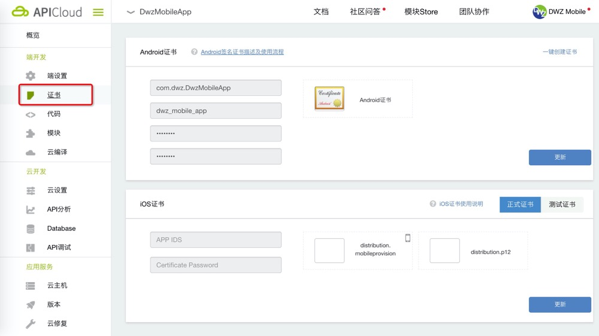
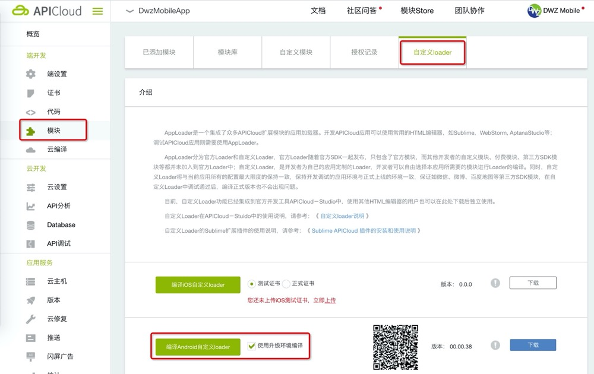
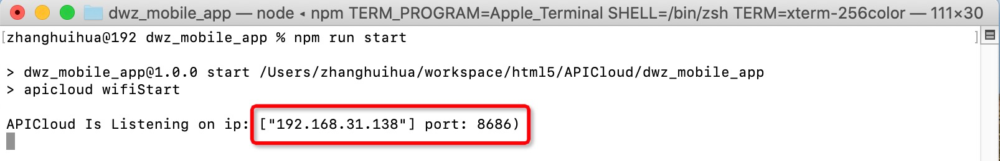
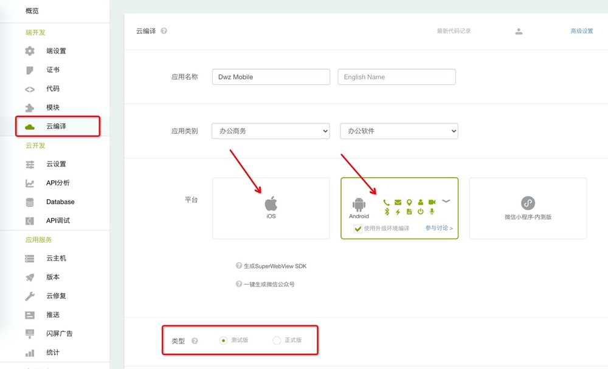
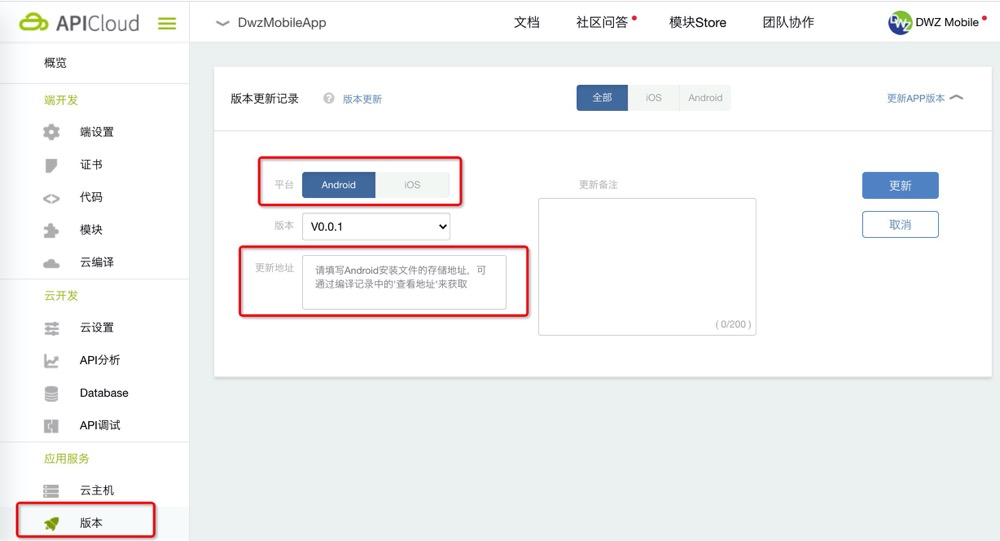
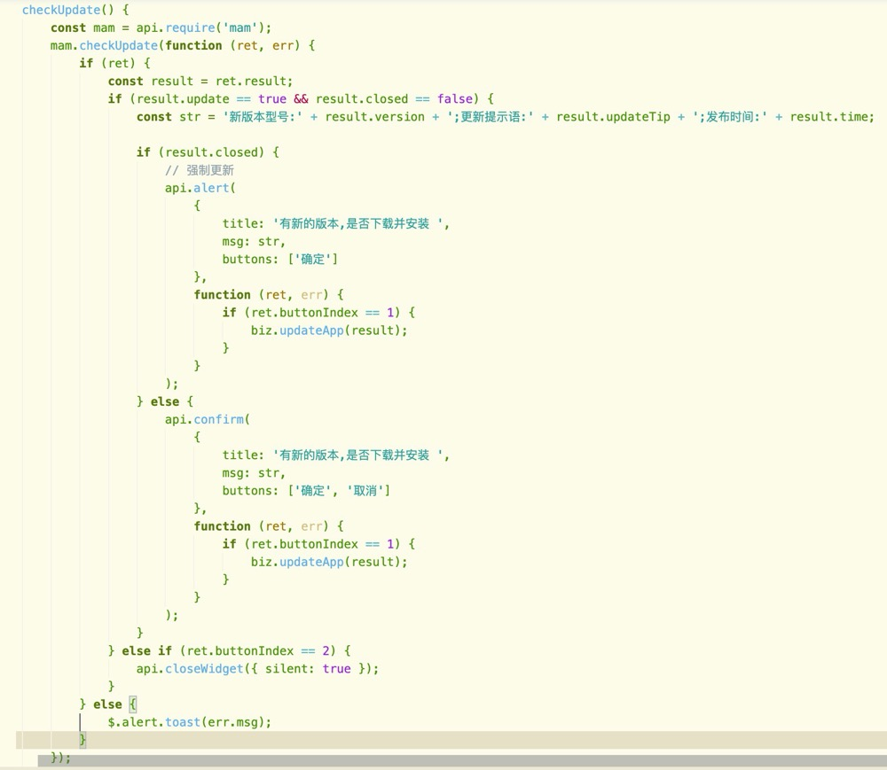

## 真机调试

- 在 APICloud 控制台配制证书
  

- APICloud【自定义 loader】打包（注意：iOS 打包需要配制测试证书）
  

- 打包完成后，手机扫码下载安装 App

- 项目根目录下，命令行执行 `npm run start`，控制台返回成功信息
  

- 打开运行自定义 loader 打包的 App，点击旁边的圆形按钮，根据上一步返回的信息输入 IP 和端口号


- 真机代码同步 `npm run sync`

- 控制台查看真机运行日志 `npm run log`

## 云打包

- 代码压缩混淆打包 `npm run build`
- index.html 页面中 `loadScripts({env: 'dev'})` 改成 `loadScripts({env: 'build'})`
- 提交代码
- 云编译



## 发布和版本更新

- 正式版打包后，下载安卓 apk 文件和 iOS ipa 文件
- 安卓 apk 文件上传到自己服务器
- iOS 需要在苹果开发者中心创建证书，并创建应用，然后再上传 ipa 文件

```
xcrun altool --validate-app -f dwz_mobile_app.ipa -t iOS --apiKey xxxxxxxx --apiIssuer xxxxxxxx-xxxx-xxxx-xxxx-xxxxxxxxxxxx --verbose
xcrun altool --upload-app -f dwz_mobile_app.ipa -t iOS --apiKey xxxxxxxxx --apiIssuer xxxxxxxx-xxxx-xxxx-xxxx-xxxxxxxxxxxx  --verbose
```

- 在 apicloud 平台上 App 版本栏目下，更新安卓 apk 下载 url，和苹果 App 应用商店 url
  

- App 中实现 App 更新代码，DWZ Mobile 框架中已经包含
  
