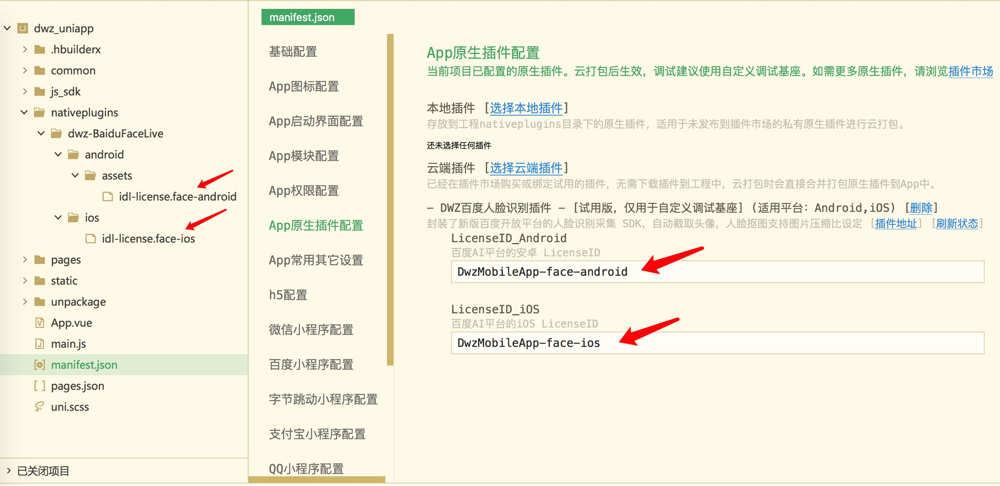

# dwz-BaiduFaceLive 人脸识别

DWZ 百度人脸识别插件【dcloud】

> ## 功能介绍

- https://ext.dcloud.net.cn/plugin?id=4794
- 封装了新版百度开放平台的人脸识别采集 SDK：
  - 包含活体动作 [faceLiveness](#a1)
  - 不包含活体动作 [faceDetect](#a2)
- 考虑灵活度问题，本插件只作人脸采集，人脸识别成功后生成 base64 头像图片，开发者可以配合自己的服务端接口实现具体的业务需求，如（实名认证、刷脸登录、人脸识别备案等）
- 人脸识别后自动截取头像，人脸抠图支持压缩比设定，从而解决了某些第三方实名认证接口图像大小不能超过 20K 的问题
- 人脸识别抠图分辨率可配制 高度 50~1200 像素，抠图高的设定，根据高度自动计算宽度（宽度=高度\*3/4）
- 人脸识别界面自带返回键，使用过程中随时可以退出人脸识别界面
- 可以免费从百度 AI 平台获取人脸采集证书，本插件针对一个 APP **一次购买永久使用**
- 跨平台支持（Android & iOS）iOS 端与 Android 端 JS 接口保持一致
- 接口支持 debug 参数设置，方便排查百度证书配制相关问题
- [dwzBaiduFaceLive【apicloud】版本](/doc/apicloud/dwzBaiduFaceLive/doc.md)
- **插件使用含技术支持，远程协助调试插件请加微信沟通**

|                   安卓 APK 测试包                    |                   技术服务微信                   |
| :--------------------------------------------------: | :----------------------------------------------: |
|  |  |

> ## 效果展示


> ## 使用攻略

1. 使用之前须从百度开放平台申请开发者账号并完成企业认证，获取 LicenseID 和 LicenseFileName。[百度开发平台控制台](https://console.bce.baidu.com/ai/#/ai/face/overview/index)
   
2. 百度 AI 平台人脸采集 License 文件放到 HBuilderX 工程目录中

- iOS 百度证书：`/nativeplugins/dwz-BaiduFaceLive/android/assets/idl-license.face-android`
- 安卓百度证书：`/nativeplugins/dwz-BaiduFaceLive/ios/idl-license.face-ios`

3. HBuilderX 工程 manifest.json --> App 原生配制 --> 选择云端插件 --> 插件市场找到 dwz-BaiduFaceLive
4. HBuilderX 工程引入原生插件 dwz-BaiduFaceLive 后，插件面板上填写 LicenseID_Android、LicenseID_iOS
   
5. 配制自定义基座打包，注意 App 包名、证书和百度 AI 平台证书一致
6. 前端代码调用插件

<div id="a1"></div>

> 包含活体动作调用

活体参数可配制，至少需要配制一个活体动作

```js
const module = uni.requireNativePlugin("dwz-BaiduFaceLive");
module.faceLiveness(
  {
    debug: 0, // 调试开关(默认:0)：0, 1
    cropType: 1, // 抠图类型(默认:1)：1:脸部, 2:大头照, 3:头像+肩膀
    cropHeight: 300, // 抠图高的设定，为了保证好的抠图效果，要求高宽比是4:3，所以会在内部进行计算，只需要传入高即可，取值范围50 ~ 1200，默认480
    quality: 70, // 抠图压缩质量，取值范围 20 ~ 100，默认100不压缩
    eye: true, // 活体动作，眨眼(默认:true)
    mouth: false, // 活体动作，张嘴(默认:false)
    headRight: false, // 活体动作，向右转头(默认:false)
    headLeft: false, // 活体动作，向左转头(默认:false)
    headUp: false, // 活体动作，向上抬头(默认:false)
    headDown: false, // 活体动作，向下低头(默认:false)
  },
  (ret) => {
    console.log(JSON.stringify(ret));
  }
);
```

<div id="a2"></div>

> 不包含活体动作调用

```js
const module = uni.requireNativePlugin("dwz-BaiduFaceLive");
module.faceDetect(
  {
    debug: 0, // 调试开关(默认:0)：0, 1
    cropType: 1, // 抠图类型(默认:1)：1:脸部, 2:大头照, 3:头像+肩膀
    cropHeight: 300, // 抠图高的设定，为了保证好的抠图效果，要求高宽比是4:3，所以会在内部进行计算，只需要传入高即可，取值范围50 ~ 1200，默认480
    quality: 70, // 抠图压缩质量，取值范围 20 ~ 100，默认100不压缩
  },
  (ret) => {
    JSON.stringify(ret);
  }
);
```

> 回调 callback(ret)

ret：

- 类型：JSON 对象
- 内部字段：

```json
{
  "status": 1, //状态值（整数）；1||0，人脸识别成功/失败
  "message": "错误提示", // 当status为0时返回错误信息
  "face": "base64人脸图片" // base64人脸图片，自动截取人脸头像的jpg图片
}
```
